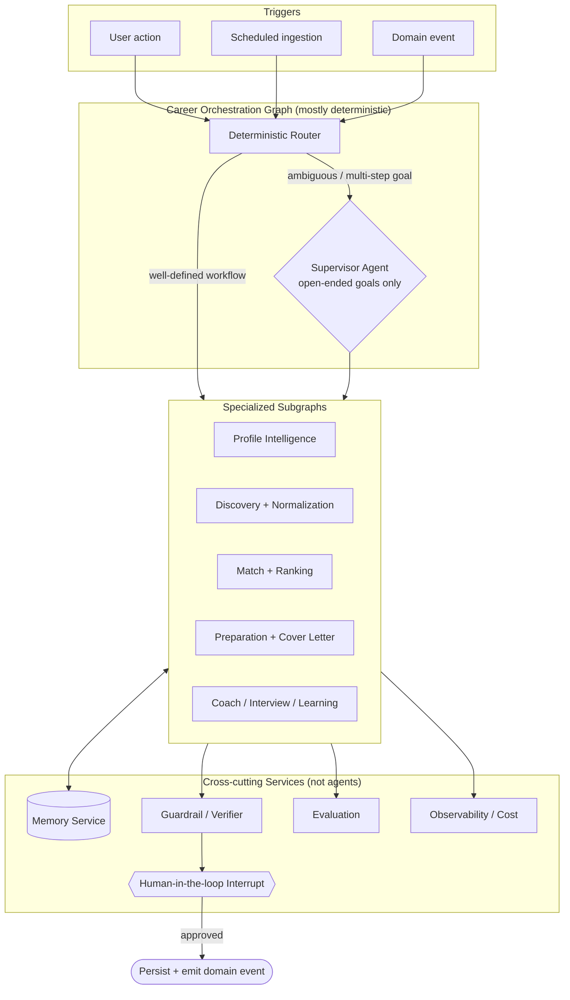

# CareerOS — AI Multi-Agent Architecture Specification

> **Status:** LOCKED (see `docs/adr/0000-lock-architecture-documents.md`). Permanent AI architecture spec. Changes require an ADR.

**Governing principle:** *"As deterministic as possible, as agentic as necessary."* Autonomy (an LLM deciding its own control flow/tools in a loop) is used only where the task genuinely requires open-ended reasoning; everything else is a deterministic graph with LLM steps.

**Substrate:** LangGraph (typed `StateGraph`, checkpointer, store, interrupts, subgraphs, map-reduce fan-out) · selective LangChain · multi-provider LLMs behind a provider Port · LangSmith.

## 1. Overall AI Architecture

A **deterministic Career Orchestration Graph** with an **embedded Supervisor** for open-ended sub-goals, composed of **specialized subgraphs**.

**Why:** the candidate lifecycle is a known pipeline → deterministic graph gives reproducibility, cheap caching, trivial evaluation. The Supervisor is invoked only for open-ended goals. Subgraphs mirror DDD contexts (evaluable/replaceable in isolation). Memory, Guardrails, Evaluation, Observability, HITL are services, not agents (avoids circular loops).

**Alternatives rejected:** single ReAct agent + many tools (non-deterministic, unevaluable, context explosion); full peer-to-peer swarm (unpredictable, unbounded cost); pure deterministic pipeline (too rigid for coaching/pivots — kept as default with Supervisor escape hatch); hierarchical multi-supervisor teams (premature; subgraphs can grow into this); monolithic mega-prompt (unmaintainable).

## 2. Supervisor Agent

| Dimension | Design |
|---|---|
| Responsibilities | Interpret open-ended goal → typed Plan of subgraph invocations → sequence/parallelize → merge → enforce policy → assemble result. Never generates domain content. |
| Decision making | Structured-output planner emitting a typed `Plan`. |
| Routing | Two-tier: deterministic Router (fast/free, ~90%) + LLM Supervisor for ambiguous only. |
| Planning | Plan-and-execute with re-planning on failure/new info (not per-step ReAct). |
| Task decomposition | Subgraph-sized units with typed contracts, independently checkpointed. |
| Failure handling | Classify (transient/tool/model/validation/policy) → matched recovery. |
| Retry | Per-node exp backoff + jitter, bounded attempts, idempotency keys, provider fallback. |
| Checkpointing | After every node; plan + intermediate results persisted. |
| Human approval | Cannot advance to externally-bound step without approved Review Task; issues `interrupt`, parks run (`WaitingForHuman`). |
| Memory access | Reads long-term/user memory to seed plans; writes episodic outcomes; scoped, read-mostly. |
| Tool selection | Holds no domain or external-write tools; invokes subgraphs only. |
| Cost optimization | Cheap model for planning; caps plan size/depth; prefers deterministic Router; per-run budget with `CostThresholdReached` abort. |

## 3. Specialized Agents

**Classification:** Agent (LLM controls flow/tools) · LLM Step (single/few structured calls at fixed position) · Deterministic (little/no LLM).

| # | Unit | Class |
|---|---|---|
| 1 | Profile Intelligence | LLM Step |
| 2 | Resume Intelligence | LLM Step |
| 3 | Opportunity Discovery | Deterministic |
| 4 | Opportunity Normalization | LLM Step (constrained) |
| 5 | Match Intelligence | LLM Step (retrieval-grounded) — CORE |
| 6 | Ranking | Deterministic (+ optional LLM re-rank) |
| 7 | Preparation (Tailoring) | Agent (bounded) — CORE |
| 8 | Cover Letter | LLM Step |
| 9 | Interview Coach | Agent (P2) |
| 10 | Career Coach | Agent (P2) |
| 11 | Learning | LLM Step |
| 12 | Memory | Deterministic service (+ LLM summarize) |
| 13 | Notification | Deterministic (+ LLM digest copy) |
| 14 | Evaluation | LLM-as-Judge Step |
| 15 | Analytics | Deterministic |

**Only 4 of 15 are true autonomous agents** — the cost discipline that scales to millions.

Per-agent detail (Purpose · Inputs · Outputs · Tools · Memory · Prompt · Failure modes · Eval · Handoff):

1. **Profile Intelligence** — Synthesize canonical profile. In: ParseResults, GitHub, links, prior version. Out: CareerProfile delta. Tools: Skill Analyzer, GitHub, embeddings. Prompt: schema extraction + cite source spans, low temp. Failures: over-claiming, mis-mapping, hallucinated experience. Eval: extraction accuracy, mapping P/R, groundedness. Handoff: `ProfileCompleted` → Matching.
2. **Resume Intelligence** — Parse + critique. In: raw resume text (post-scan). Out: ParseResult + quality report. Tools: Resume Parser, Skill Analyzer. Stateless. Failures: layout/date/section errors. Eval: parse accuracy, section F1. Handoff → Profile.
3. **Opportunity Discovery** — Poll permitted sources; detect new/changed. Tools: Job Search adapters, dedup fingerprint. Memory: source cursors. Failures: outage, rate limits, drift, ToS lapse. Eval: coverage, freshness lag, error rate. Handoff → Normalization.
4. **Opportunity Normalization** — Messy listing → canonical Opportunity. Cheapest model; strict schema; no inference of missing comp. Cache by fingerprint. Failures: hallucinated salary/requirements. Eval: accuracy, no-fabrication rate. Handoff: `OpportunityActivated` → Matching.
5. **Match Intelligence (CORE)** — Explainable fit. In: Profile version, Opportunity, PreferenceCriteria. Out: Match (score + reasons + gaps + hard-filter result + model version). Tools: Job Matcher, Skill Analyzer. Prompt: deterministic hard-filters first, then LLM reasons over retrieved evidence with a scoring rubric; cite evidence. Failures: keyword overfit, ignoring hard filters, unexplained scores, bias. Eval: ranking correlation, explanation faithfulness, hard-filter violation = 0, calibration. Handoff → Ranking/Recommendation/Notification.
6. **Ranking** — Order surfaced Matches. Deterministic scoring/sort; optional LLM re-rank top-K only. Failures: popularity bias, staleness, filter bubble. Eval: nDCG/MAP, diversity. Handoff → Notification; select → Preparation.
7. **Preparation/Tailoring (CORE, Agent)** — Grounded tailored resume, iterated. In: Profile version, Opportunity, Match. Out: draft + rationale. Tools: Document Generator, Skill Analyzer, Guardrail, Company Research. Prompt: draft → self-critique vs grounding+JD → revise (bounded N) → guardrail. Failures: **fabrication (highest severity)**, tone mismatch, keyword stuffing. Eval: **truthfulness/zero-fabrication**, JD-alignment, edit-distance, acceptance. Handoff → Guardrail → **Human Review (mandatory)**.
8. **Cover Letter** — Grounded letter. Tools: Document Generator, Company Research. Single generation + guardrail; no invented facts. Eval: personalization, groundedness, acceptance. Handoff → Guardrail → Human Review.
9. **Interview Coach (P2, Agent)** — Adaptive mock interviews + feedback. Conversation + long-term progress memory. Eval: question relevance, feedback usefulness, calibration.
10. **Career Coach (P2, Agent)** — Open-ended guidance. Rich long-term memory. Plan-and-execute with reflection; via Supervisor. Failures: generic advice, unrealistic promises, hallucinated claims. Eval: actionability, grounding, helpfulness, goal progress.
11. **Learning** — Gaps → curated learning path. Grounded in curated catalog (no hallucinated courses). Eval: resource validity, relevance, gap coverage.
12. **Memory (service)** — Read/write/reconcile memory. Vector store + memory store + LLM summarizer. Rule-based reconciliation. Eval: recall precision, contradiction rate, retention compliance.
13. **Notification** — Compose + dispatch per policy. LLM for digest copy only. Eval: engagement, unsubscribe, cap-compliance.
14. **Evaluation (LLM-as-Judge)** — Score outputs (offline CI + online sampling). Diverse judge models; rubric CoT; multiple judges for high-stakes. Meta-eval: human agreement, stability.
15. **Analytics** — Aggregate events into metrics. No LLM. Data-quality checks.

## 4. Shared State (LangGraph)

Small, typed, namespaced, reference-based. Carries pointers + summaries, not payloads.

| Category | Contents | Mutability | Ownership |
|---|---|---|---|
| Immutable inputs | goal, candidateId, profileVersionRef, consentScope, config | Immutable for run | Router/Supervisor |
| Namespaced slices | one sub-object per subgraph | Mutable by owning subgraph only | Each subgraph |
| Append-only logs | steps, tool invocations, messages, decisions | Append-only (reducer) | Framework/all |
| Control state | plan, cursor, status, budget, retries | Mutable | Supervisor |
| References | ids/URIs to docs, opportunities, artifacts, memory | Mutable (append) | All |
| Checkpoint state | full serialized snapshot per node | Persisted | Checkpointer |

**Rules:** ownership enforced by convention + commutative reducers (safe parallel fan-out merges); immutable inputs never mutated; no raw documents in state (hydrate by reference); checkpoint every node (resume/HITL/time-travel).

## 5. Memory Architecture

| Type | Holds | Backed by | Scope |
|---|---|---|---|
| Short-term/Working | Run intermediate state | Checkpointer (Postgres) | Per run |
| Conversation | Multi-turn dialogue | Checkpointer + summaries | Per session |
| User memory | Stable facts/preferences | Store + vector | Durable, consent-bound |
| Episodic | Past runs/outcomes | Store + events | Durable |
| Semantic | Embeddings (profile/opportunities/knowledge) | Vector (pgvector→Qdrant) | Durable |
| Procedural | Strategies, exemplars, tuned prompts | Store / prompt registry | Durable, versioned |
| Agent memory | Per-agent scratch + calibration | Store | Per-agent |

**Strategies:** tiered retention (working short; long-term durable but consent-scoped; approval/audit retained anonymized); progressive summarization (store facts not transcripts); active decay (recency/relevance/confidence; contradictions reconciled; user can view/delete); anti-poisoning (only consented/validated data; ingested text can never write long-term memory).

## 6. Tool Architecture

Permission-classified: read-only · internal-write · external side-effect. External-write disabled for all agents until an approved Review Task exists.

| Tool | Class | Safety / Retry / Caching |
|---|---|---|
| Resume Parser | read | Scanned file only; sandboxed; retry on transient; cache by checksum |
| Job Search | read | Permitted sources + provenance; backoff on 429/5xx; cache per source window |
| Job Normalizer | read/LLM | No fabrication; deterministic retry; cache by fingerprint |
| Job Matcher | read | Hard filters absolute; deterministic; cache (profileVer × opportunity) |
| Skill Analyzer | read | Taxonomy-governed; deterministic; cache by input set |
| Document Generator | internal-write | Grounding-checked, draft-only; regenerate on validation fail; cache (profileVer, oppId, template) |
| GitHub | read | Official API, minimal scopes; backoff; cache TTL |
| LinkedIn | read (constrained) | No scraping; user-initiated only; backoff; cache TTL |
| Company Research | read | Permitted sources; cite; backoff; cache TTL |
| Salary Estimator | read | Label as estimate; deterministic; cache by inputs |
| Interview Q Generator | read/LLM | On-topic guardrail; regenerate; cache by inputs |
| Email | external | Consent + frequency cap; **no external application submission**; idempotent |
| Calendar | external (future) | User-owned only; **no external booking in MVP**; idempotent |

**There is no "apply to job" or "message recruiter" tool** — a deliberate safeguard. Email/Calendar are user-facing only.

## 7. Agent Communication

| Mechanism | Used for | Rule |
|---|---|---|
| Shared state (in-run) | Results within one run | Write own namespace; read scoped slices |
| Handoff (Command) | Control transfer | Typed; references + summary, not payloads |
| Domain events | Cross-run/context reactions | Fire-and-forget; consumers idempotent |
| Messages | Multi-turn dialogue | Structured turns; summarized when long |
| Memory service | Durable context | Scoped, read-mostly |

**Avoiding context explosion:** pass references not payloads; scoped state slices; summarize handoffs; subgraph isolation; retrieval on demand (top-K); bounded logs in context.

## 8. Planning Strategy

Plan-and-execute (typed Plan; re-plan on failure) → reflection (output vs contract) → self-critique (bounded revision for generative steps) → verification (guardrails + grounding + Evaluation Agent) → guardrails (input injection defense + output fabrication/PII/tone/policy) → recovery (failure taxonomy → retry/backoff, provider fallback, degrade, clean abort with preserved state). Guardrails run before the human sees an artifact.

## 9. Evaluation Framework

Two loops: **offline** (golden datasets gate every prompt/agent/model change in CI) and **online** (continuous sampling + human feedback grows the golden set).

| Output | Metrics |
|---|---|
| Grounding (all generative) | Groundedness/faithfulness |
| Hallucination | Hallucination rate |
| Resume truthfulness | **Zero-fabrication (hard gate)** |
| Job relevance | Precision/recall |
| Ranking | nDCG, MAP, diversity |
| Recommendation | Acceptance/dismissal rate |
| Preparation | Edit-distance, acceptance, JD-alignment |
| Match explanation | Explanation faithfulness |

Judges are different models from generators; high-stakes use multiple judges + deterministic checks; human edits are gold signal; judges meta-evaluated vs human agreement. **Resume truthfulness is the one hard-gated, zero-tolerance metric.**

## 10. Observability

One `traceId` end-to-end. LangSmith per Agent Run (nested spans) correlated to `AgentRun` + domain events + cost. Metrics: success/failure, HITL/guardrail rates, eval scores, per-user cost, latency p50/95/99, token usage + cache hit rate + context-size trend. Structured logs (PII-redacted). Health checks. Alerting on error rate, p99, queue lag, cost anomalies, eval regressions. Failed runs preserve state for replay.

## 11. Human-in-the-Loop

| REQUIRED | NOT required |
|---|---|
| Tailored resume before download/hand-off | Resume parsing |
| Cover letter before use | Profile construction/enrichment |
| Any artifact leaving the platform | Match computation & scoring |
| Confirming an application was "applied" | Ranking & recommendation surfacing |
| *(Future)* external message/negotiation | Digest composition (delivery still consent-capped) |
| *(Future)* autonomous actions | Internal memory writes, evaluation, analytics |

Internal analysis is reversible → not gated. External/representational artifacts get a structural interrupt (`WaitingForHuman`), an immutable `ReviewTask`, and the load-bearing `ArtifactApproved` event. Enforced at graph + tool layers, not by prompt.

## 12. Cost Optimization

Minimize LLM calls (deterministic routing ~90%, rules before LLM, plan-and-execute, demote agents where possible); model routing/cascade (cheap for extraction/normalization/routing, premium only for the two core generative tasks); caching (exact + semantic + provider prompt caching); batching (embeddings, bulk jobs); parallelism (map-reduce fan-out); context discipline (reference-passing, top-K, bounded logs); bounded loops (capped critique/plan/retries); budgets (per-run + per-candidate caps, abort on threshold); distillation (future: small models for high-volume tasks).

## 13. Future AI Roadmap

| Capability | Plug-in point | Autonomy / HITL |
|---|---|---|
| Voice | I/O adapter over existing agents | Unchanged HITL |
| Vision | Multimodal parsing step + tool | Internal, no new external action |
| AI Recruiter (B2B) | New contexts + persona | Recruiter-approved |
| AI Interviewer | Extends Interview Coach | HITL for external scheduling |
| AI Negotiator | Agent on `OfferReceived` | Mandatory HITL on external messages |
| AI Mentor | Extends Career Coach + deep memory | Advisory; no external action |
| Autonomous Career Agent | Supervisor gains proactive triggers | Still HITL before anything external |

**Permanent line:** increasing autonomy applies to analysis/preparation. Autonomous external action requires official partner/API channels (not scraping), legal sign-off, and proven evaluation maturity — and even then defaults to supervised.

## Assumptions & Open Questions

**Assumptions:** 4 of 15 are true agents; multi-provider behind a Port; semantic memory starts on pgvector; no external-submission tool in MVP; golden datasets bootstrapped from user edits; coaching agents are P2.

**Open Questions:** (1) Match recomputation strategy (dominant cost). (2) Judge model selection/governance. (3) Golden dataset bootstrap. (4) Memory consent granularity (legal). (5) Prep self-critique iteration budget. (6) Fine-tuning/distillation timeline. (7) Supervisor invocation threshold.
