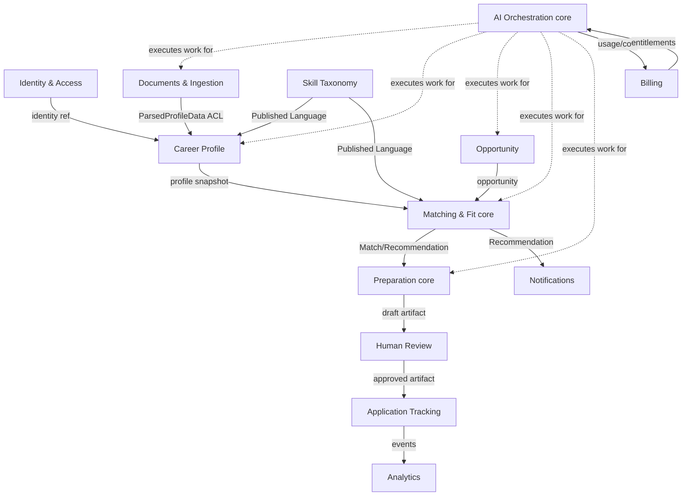
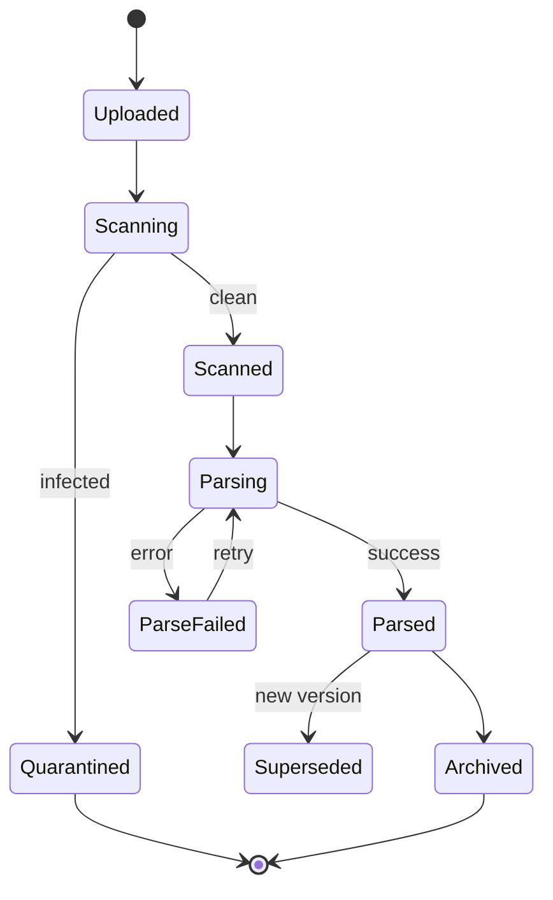
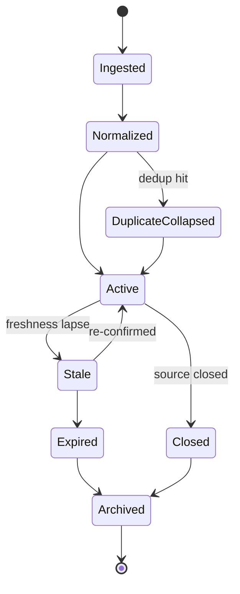
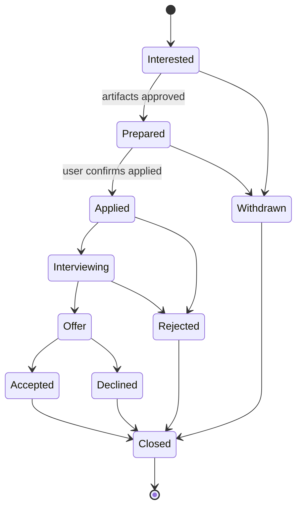
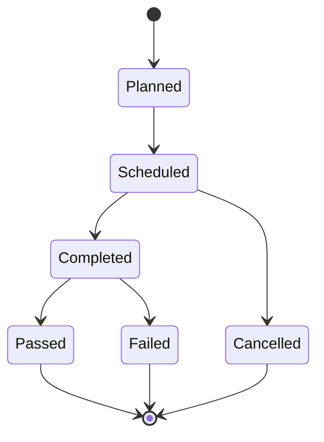
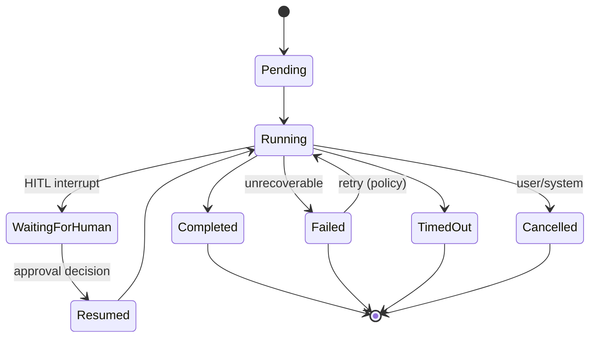

# CareerOS — Domain-Driven Design Foundation

> **Status:** LOCKED (see `docs/adr/0000-lock-architecture-documents.md`). Source of truth for the ubiquitous language and domain boundaries. Changes require an ADR.

**Core domain:** the trio of **Matching/Fit, Preparation/Tailoring, and AI Orchestration** — the moat. Identity, Billing, Notifications are *generic* subdomains; Candidate Profile, Opportunity, Application Tracking, Human Review are *supporting*.

## 1. Ubiquitous Language

| Term | Definition | Note |
|---|---|---|
| **User** | An authenticated account holder (identity/auth). | Distinct from Candidate. |
| **Candidate** | The career-domain persona of a User. | Subject of core behavior. |
| **Career Profile** | Canonical system-derived structured model of a Candidate. | Derived, not uploaded. |
| **Preference Set** | Named config of what the Candidate wants. | May hold multiple. |
| **Document** | Uploaded artifact (Resume, Cover Letter, Cert, Portfolio file). Raw, immutable. | Generic parent. |
| **Resume** | A Document type (CV). Versioned. | Uploaded resume ≠ Tailored Resume. |
| **Cover Letter** | Document type; uploaded (base) or generated (draft). | |
| **Certification** | Credential evidencing a skill/qualification. | |
| **Portfolio** | Collection of ExternalLinks/Documents evidencing work. | |
| **External Link** | URL reference (GitHub, LinkedIn, site). | Enrichment source. |
| **Skill** | Named competency. Canonical definition = **Skill** entity (Skill Taxonomy); a candidate's *use* of it = **SkillRef** VO (proficiency + evidence). | Don't conflate the two. |
| **Skill Taxonomy** | Canonical curated catalog of skills + relationships. | Shared reference data. |
| **Experience** | A period of employment/role. | |
| **Seniority** | System-estimated level. | Estimated VO. |
| **Opportunity** | Normalized, deduplicated career opening from a permitted source. | Replaces "Job". |
| **Opportunity Source** | Permitted origin + provenance. | Legal/traceability first-class. |
| **Company** | Organization referenced by Opportunities/Preferences. | Reference entity. |
| **Match** | Evaluated fit between a Profile and an Opportunity: score + explanation + gaps. | Replaces vague "Recommendation". |
| **Match Score** | Quantified fit + model/version. | VO, paired with reasons. |
| **Skill Gap** | Requirement present in Opportunity but weak/absent in Profile. | Drives preparation. |
| **Recommendation** | A surfaced, ranked Match that crossed the threshold. | Not every Match is recommended. |
| **Preparation Artifact** | AI-generated draft (Tailored Resume, Cover Letter, Prep Plan). | Draft until approved. |
| **Tailored Resume** | Resume adapted to an Opportunity, grounded in Profile. | Never invents content. |
| **Prep Plan** | Artifact listing gaps + prep steps. | |
| **Review Task** | Human-approval unit gating externally-bound artifacts. | Immutable audit. |
| **Approval** | Candidate's explicit approve/edit/reject decision. | Legally significant. |
| **Application** | Candidate's tracked pursuit of an Opportunity (status pipeline). | We do NOT auto-submit. |
| **Application Event** | A status transition in an Application's history. | |
| **Interview** | Tracked interview stage within an Application. | MVP: tracking + prep. |
| **Offer** | Tracked job offer within an Application. | |
| **Career Goal** | Longer-term objective. | Lightweight in MVP. |
| **Agent** | Specialized AI unit, single responsibility, typed I/O. | |
| **Supervisor** | Orchestrator agent routing specialists. | Doesn't do domain work. |
| **Agent Run** | One execution of an agent graph: state, checkpoints, cost, trace, result. | Observable, auditable. |
| **Tool Invocation** | One tool call, permission-classified. | External-write disabled pre-Approval. |
| **Checkpoint** | Persisted snapshot of Agent Run state. | Enables resume/HITL. |
| **Knowledge / Memory** | Durable learned facts (Long-Term) + per-run state (Short-Term). | The moat. |
| **Digest** | Curated summary of new Recommendations. | |
| **Notification** | Message respecting consent + frequency caps. | |
| **Consent** | Recorded, purpose-scoped permission. | DPDP requirement. |
| **Subscription / Plan** | Billing entitlement level. | Generic subdomain. |
| **Recruiter** | *(Future/B2B)* hiring-side persona. | Out of MVP; language reserved. |
| **Tenant / Organization** | *(Future/B2B)* institutional owner. | Schema-reserved (nullable). |

**Deliberate disambiguation:** "Job → Opportunity" and "Recommendation → Match + Recommendation" eliminate the most common source of model erosion.

## 2. Core Business Capabilities

| Capability Group | Subdomain Type |
|---|---|
| Identity & Access | Generic |
| Career Profile | Supporting |
| Document & Ingestion | Supporting |
| Opportunity Discovery | Supporting → strategic |
| Matching & Fit | **CORE** |
| Preparation | **CORE** |
| Human Review & Actioning | Supporting (safety-critical) |
| AI Orchestration & Ops | **CORE** |
| Application Tracking | Supporting |
| Notifications | Generic |
| Analytics & Insight | Supporting |
| Billing & Entitlements | Generic |
| Administration & Trust/Safety | Generic/Supporting |

Treat Matching/Prep/AI-Orchestration as *core* (best engineers) and Identity/Notifications/Billing as *generic* (buy/delegate).

## 3. Bounded Contexts

| Bounded Context | Owns (language) | Subdomain | Why it exists |
|---|---|---|---|
| Identity & Access | User, Consent, Session, Tenant(reserved) | Generic | Auth/privacy evolve independently. |
| Career Profile | Candidate, Career Profile, Preference Set, Skill (as used), Career Goal, Seniority | Supporting | Changes with how we model candidates. |
| Documents & Ingestion | Document, Resume(raw), External Link, ParseResult, Enrichment | Supporting | Changes with formats/parsers/sources. |
| Skill Taxonomy | Skill (canonical), Alias, Relationship | Supporting (shared) | Curated reference data with own governance. |
| Opportunity | Opportunity, Source, Company, Provenance, Dedup | Supporting/strategic | Changes per source + legal constraints. |
| Matching & Fit | Match, Match Score, Skill Gap, Recommendation, Ranking | Core | The differentiator; changes with model/eval. |
| Preparation | Preparation Artifact, Tailored Resume, Cover Letter (gen), Prep Plan | Core | Generation quality evolves independently. |
| Human Review & Actioning | Review Task, Approval, Hand-off | Supporting (safety) | The safety kernel; stable. |
| Application Tracking | Application, Application Event, Interview, Offer | Supporting | Candidate's CRM. |
| AI Orchestration & Ops | Agent, Supervisor, Agent Run, Tool Invocation, Checkpoint, Memory, Eval, Guardrail | Core | Execution substrate. |
| Notifications | Notification, Digest, Channel, Frequency Policy | Generic | Delivery mechanics. |
| Billing & Entitlements | Subscription, Plan, Entitlement, Usage/Cost Cap | Generic | Pricing/packaging. |
| Analytics | Insight, Metric | Supporting | Read model. |
| Administration & Trust/Safety | Admin action, Moderation, Source policy, Compliance record | Generic/Supporting | Ops concern. |

### Context Map

**Integration patterns:** Documents→Profile = ACL; Skill Taxonomy→consumers = Published Language; Matching→Preparation = Customer-Supplier; Preparation→Review→Application = Customer-Supplier + safety gate; AI Orchestration↔contexts = Open Host/Service; External sources→Opportunity = ACL; everything→Analytics = event consumer; IAM→all = Conformist. **Cross-context = async domain events; sync only within a context or read-side.**

## 4. Entities

(Aggregate roots marked ★.) Format: Purpose · Identity · Lifecycle · Relationships · Rules.

**IAM:** **User ★** (identity anchor; `UserId`; Registered→Active→Suspended→DeletionRequested→Erased; owns Consents; can't hard-delete under legal hold). **Consent** (purpose-scoped permission; processing illegal without active matching Consent).

**Career Profile:** **Candidate ★** (`CandidateId` 1:1 with UserId; owns Profile/Preferences/Goals). **Career Profile** (`CareerProfileId`+`version`; Draft→Complete→continuously-updated; versioned & immutable-per-version; content derived, never fabricated). **Experience** (coherent date ranges). **Career Goal** (lightweight MVP).

**Documents:** **Document ★** (`DocumentId`; Uploaded→Scanning→Scanned→Parsing→Parsed/Failed→Archived; raw bytes immutable; infected quarantined). **ResumeVersion** (append-only). **ParseResult** (never overwrites raw; feeds Profile via ACL; carries confidence).

**Skill Taxonomy:** **Skill (canonical) ★** (`SkillId`; Proposed→Approved→Deprecated; governed; referenced by ID never free-text).

**Opportunity:** **Opportunity ★** (`OpportunityId`+`DedupKey`; Ingested→Normalized→Active→Stale→Expired/Closed→Archived; permitted Source + provenance required; duplicates collapse). **Company** (`CompanyId`; conservative entity resolution). **Opportunity Source** (documented legal basis; ingestion disabled if terms lapse).

**Matching (core):** **Match ★** (Profile version + Opportunity + model version; Computed→Surfaced/Suppressed→Stale→Recomputed; must include explanation + model version; hard filters absolute). **Recommendation** (Surfaced→Viewed→Acted/Dismissed→Expired; ranking explainable; dismissals feed memory).

**Preparation (core):** **Preparation Artifact ★** (`ArtifactId`; Draft→Guardrail-Checked→PendingReview→Edited→Approved/Rejected/Discarded; always draft until Approved; grounded; carries sourceProfileVersion).

**Human Review (safety):** **Review Task ★** (Pending→InReview→Approved/Rejected/EditedAndApproved; decision immutable; records who/when/edits; no artifact leaves without an Approved Review Task).

**Application Tracking:** **Application ★** (Interested→Prepared→Applied→Interviewing→Offer→Accepted/Rejected/Withdrawn→Closed; one active per Candidate×Opportunity; user-confirmed statuses). **Interview** (Planned→Scheduled→Completed→Passed/Failed/Cancelled). **Offer** (Received→UnderConsideration→Accepted/Declined/Expired).

**AI Orchestration (core):** **Agent Run ★** (`AgentRunId`+traceId; Pending→Running→WaitingForHuman→Resumed→Completed/Failed/Cancelled/TimedOut; checkpointed + traced + cost; no external-write while approval pending). **Tool Invocation** (classified read/write/external; external-write unavailable pre-Approval; logged). **Memory Record** (Learned→Reinforced/Contradicted→Decayed/Retired; consented data only).

**Billing:** **Subscription ★** (Trialing→Active→PastDue→Cancelled→Expired; entitlements gate features; cost caps). **Notifications:** **Notification ★** (Queued→Sent→Delivered/Failed→Read; consent + frequency caps).

## 5. Value Objects

EmailAddress, Money/SalaryRange (`{min,max,currency,confidential}`), Location, WorkMode, NoticePeriod, SkillRef (canonical SkillId + proficiency + evidence), SeniorityEstimate, DateRange, MatchScore, ScoreExplanation, DedupKey/Fingerprint, Provenance, FileRef, URL/ExternalLink target, Cost, ConsentScope, PreferenceCriteria snapshot, PhoneNumber, Proficiency.

**Judgement calls:** SalaryRange is a VO (no lifecycle). Canonical Skill is an Entity (governed); a candidate's *use* of a skill is a VO (SkillRef). MatchScore + ScoreExplanation are VOs bundled into Match (immutable computation output).

## 6. Aggregates & Transaction Boundaries

**Rule:** one aggregate = one transactional consistency boundary; cross-aggregate consistency is eventual (events). Aggregates kept small.

| Aggregate Root | Contains | Boundary | Why |
|---|---|---|---|
| User | Consents | User + Consents atomic | Legal correctness. |
| Candidate | Career Goals, refs | Candidate attributes | Lean; Profile split out. |
| Career Profile (version) | Experiences, Education, SkillRefs, Seniority | Whole version atomic & immutable | Reproducibility. |
| Document | ResumeVersions, ParseResult link | Ingestion state per doc | Consistency. |
| Skill (canonical) | Aliases, relationships | Taxonomy node | Central governance. |
| Opportunity | Provenance, source refs, Company ref | Normalization + dedup | Atomic per opportunity. |
| Match | MatchScore, Explanation, Gaps, Recommendation state | One computation + surfacing | Single result. |
| Preparation Artifact | draft, status | Artifact + review-gating status | One unit. |
| Review Task | Approval, edits | The human decision | Immutable safety kernel. |
| Application | Events, Interviews, Offer | Pipeline + history | One pursuit. |
| Agent Run | Checkpoints, Tool Invocations, Cost | Run state per checkpoint | Resume/HITL. |
| Subscription | Entitlements, caps | Billing state | Consistent checks. |
| Notification | — | Delivery state | Simple. |

**Boundary decisions:** Candidate ≠ Career Profile (Profile mutates constantly → separate to reduce contention; eventual consistency via `ProfileCompleted`). Match is its own aggregate (highest cardinality). Review Task separate from Artifact (different criticality/rate of change). Application owns Interviews/Offer, references Opportunity/Artifacts by ID.

## 7. Domain Events

| Context | Events |
|---|---|
| IAM | UserRegistered, UserEmailVerified, ConsentGranted, ConsentWithdrawn, AccountDeletionRequested, UserErased, UserSuspended |
| Career Profile | CandidateCreated, CareerProfileDrafted, ProfileEnriched, ProfileCompleted, NewProfileVersionCreated, PreferenceSetCreated, PreferenceSetUpdated, CareerGoalSet |
| Documents | DocumentUploaded, DocumentScanCompleted, DocumentQuarantined, ResumeVersionAdded, DocumentParsingStarted, ResumeParsed, DocumentParseFailed, ExternalLinkAdded, GitHubEnriched |
| Skill Taxonomy | SkillProposed, SkillApproved, SkillDeprecated, SkillAliasAdded |
| Opportunity | OpportunityIngested, OpportunityNormalized, DuplicateOpportunityCollapsed, OpportunityActivated, OpportunityMarkedStale, OpportunityExpired, CompanyEnriched, SourceDisabled |
| Matching | MatchComputed, RecommendationSurfaced, RecommendationViewed, RecommendationDismissed, MatchMarkedStale, SkillGapIdentified |
| Preparation | PreparationRequested, ArtifactDrafted, ArtifactGuardrailPassed, ArtifactGuardrailFailed, ArtifactSubmittedForReview |
| Human Review | ReviewTaskCreated, ReviewStarted, ArtifactApproved, ArtifactEditedAndApproved, ArtifactRejected |
| Application | ApplicationCreated, ApplicationMarkedPrepared, ApplicationMarkedApplied, InterviewAdded, InterviewScheduled, InterviewCompleted, OfferReceived, OfferAccepted, OfferDeclined, ApplicationWithdrawn, ApplicationClosed |
| AI Orchestration | AgentRunStarted, ToolInvoked, RunCheckpointed, RunAwaitingHuman, RunResumed, AgentRunCompleted, AgentRunFailed, AgentRunCancelled, CostThresholdReached, MemoryRecorded |
| Billing | SubscriptionStarted, SubscriptionRenewed, SubscriptionPastDue, SubscriptionCancelled, UsageLimitReached |
| Notifications | DigestComposed, NotificationSent, NotificationRead, NotificationFailed |

Events are the only cross-context coupling; versioned from day one. **`ArtifactApproved` is the legally load-bearing event** (proof a human authorized anything externally-bound) — immutable, permanently retained (anonymized under minimization).

## 8. Repositories (responsibilities only)

One per aggregate root; persist/retrieve the aggregate + retrieval by identity/spec; no business logic, no cross-aggregate joins: UserRepository, CandidateRepository, CareerProfileRepository, DocumentRepository, SkillTaxonomyRepository, OpportunityRepository, CompanyRepository, MatchRepository, PreparationArtifactRepository, ReviewTaskRepository, ApplicationRepository, AgentRunRepository, MemoryRepository, SubscriptionRepository, NotificationRepository. **Read models (CQRS-lite)** serve ranking feeds/dashboards/analytics via query services, not by loading aggregates.

## 9. Application Services (responsibilities only)

RegistrationService, ConsentService, ProfileService, PreferenceService, DocumentIngestionService, EnrichmentService, OpportunityIngestionService, MatchingService, RecommendationService, PreparationService, ReviewService, ApplicationService, AgentOrchestrationService, MemoryService, NotificationService, BillingService, AccountLifecycleService (export/erasure). They orchestrate use cases; business rules live in the domain.

## 10. Policies

| Policy | Rule |
|---|---|
| Human Approval Before External Action | No artifact leaves without an approved Review Task; agents can't use external-write tools while approval pending. |
| Grounded Generation | No skills/experience absent from the source Profile version. |
| Duplicate Opportunity Detection | Matching fingerprints collapse into one Opportunity. |
| Duplicate Application Guard | ≤ 1 active Application per (Candidate, Opportunity). |
| Application Cooldown | Configurable cooldown on re-engaging closed Opportunities/Companies. |
| Resume/Profile Versioning | New parses/edits create versions; drafts pin the version. |
| Hard Filter Absoluteness | Exclusions never overridden by a high score. |
| Recommendation Surfacing Threshold | Only Matches above threshold (and passing hard filters) become Recommendations. |
| Consent-Gated Processing | Processing requires active matching Consent; withdrawal halts it. |
| Cost/Usage Cap | Per-candidate AI cost bounded by entitlement. |
| Notification Frequency Cap | Bounded per candidate preference. |
| Freshness/Staleness | Beyond window → Stale → Expired; dependent Matches marked stale. |
| Interview Reminder | Timed reminders (respect notification policy). |
| Guardrail-Before-Review | Artifacts pass automated guardrails before the human queue. |
| Data Retention & Erasure | Retain per legal minimums; erase on request; preserve anonymized approval audit. |
| Provenance Required | No Opportunity without recorded Source provenance + legal basis. |

## 11. State Machines

### Resume / Document

### Opportunity

### Application

### Interview

### Agent Execution

## 12. End-to-End Event Flow

1. **Signup** → `UserRegistered` + `ConsentGranted` → Candidate created.
2. **Resume upload** → scan → AI parse (Profile Analyst) → `ResumeParsed`.
3. **Profile** built via ACL → `ProfileCompleted`.
4. **Preferences** configured → `PreferenceSetUpdated`.
5. **Opportunities** ingested continuously → `OpportunityActivated`.
6. **Matching** triggered by profile change or new opportunities → `MatchComputed` → threshold → `RecommendationSurfaced`.
7. **Preparation** on demand → draft → guardrail → Review Task.
8. **Human Review** → `ArtifactApproved` (load-bearing consent event).
9. **Application** — user confirms hand-off/applied (no auto-submit) → tracked through Interview → Offer.

Every AI step is an Agent Run with checkpoints, cost, trace; every externally-bound step passes Human Review.

## 13. Future-Proofing

| Future Module | Plug-in point | Type |
|---|---|---|
| Salary Negotiation Agent | Agent reading Application/Offer; `OfferReceived` → strategy → Human Review | Extends core |
| Career Coach Agent | Agent + Coaching context; consumes profile/goals/memory | Extends core |
| Learning Agent | New Learning context; `SkillGapIdentified` → learning paths | New supporting |
| Referral Agent | New context; `RecommendationSurfaced` + Company graph | New context |
| Interview Simulator | Extends Application/Interview; `InterviewScheduled` → mocks | Extends supporting |
| Recruiter CRM (B2B) | New Recruiter contexts + persona | New product surface |
| B2B / Institutions | Activate reserved Tenant/Organization; tenant-scoping | Strategic (planned-for) |
| Global Jobs / Verticals | New Sources (ACL) + expanded taxonomy + locale | Config + reference-data growth |
| Candidate Analytics | Analytics read models; all events | Read-model expansion |
| Marketplace/Partner APIs | Open Host Service published contracts | Integration surface |

Holds up because contexts communicate only via events/contracts; new AI capabilities are new agents under an unchanged Supervisor; Tenant/Organization reserved now; external sources always enter via ACL.

## Assumptions & Open Questions

**Assumptions:** B2C MVP (Recruiter/Tenant reserved); no auto-submission; opportunities from permitted sources only; curated Skill Taxonomy; eventual consistency acceptable except Human-Approval/Consent gates; lightweight Career Goal in MVP; Analytics is a read-model consumer.

**Open Questions:** (1) Skill Taxonomy sourcing (build/adopt/hybrid). (2) Multiple Preference Sets in MVP? (3) Match recomputation strategy (event-driven vs. batched). (4) Recommendation threshold ownership. (5) Memory scope & consent. (6) Interview/Offer depth in MVP. (7) Entity-resolution aggressiveness for dedup.
