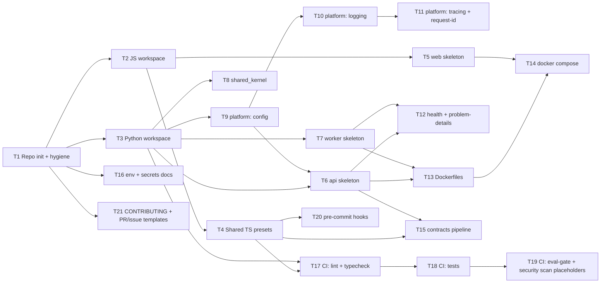

# Milestone M0 — Foundations (Engineering Plan)

> **Goal of M0:** establish the repository rails so feature work (M1+) can proceed safely and
> consistently. **No product features and no business logic in M0** — only scaffolding, tooling,
> platform primitives, and quality gates.
>
> **Source of truth:** `docs/technical-architecture.md` (§1 Monorepo, §2 Backend, §8 Config,
> §10 Observability, §11 Deployment, §13 Roadmap) and `docs/engineering-constitution.md`.
>
> **Definition of Milestone Done:** a contributor can clone the repo, run `docker compose up`,
> get healthy `api` + `worker` + `web` locally, and open a PR that passes all CI gates
> (lint, typecheck, tests, eval-gate placeholder, security scan).

## Task rules

Each task below is **independent, reviewable, mergeable, testable, and < 1 day**. Tasks list
their dependencies; unrelated tasks can be worked in parallel. No task introduces application
code — scaffolds boot but contain no domain logic.

## Dependency overview

## Tasks

### T1 — Repository initialization & hygiene
- **Scope:** `git init`; `.gitignore` (Python/Node/OS/secrets); `.editorconfig`; `LICENSE`; root `README` skeleton linking `AGENTS.md` + locked docs; top-level folder placeholders (`apps/ packages/ shared/ agents/ contexts/ evals/ infra/ docs/`) with `.gitkeep`.
- **Depends on:** none.
- **Deliverable:** clean initialized repo matching the locked folder structure.
- **Testable / acceptance:** `git status` clean; no secrets tracked; folder layout matches Technical Architecture §1.

### T2 — JS/TS workspace skeleton
- **Scope:** `pnpm-workspace.yaml`, root `package.json`, `turbo.json` with empty task pipeline; Node/pnpm version pinned.
- **Depends on:** T1.
- **Deliverable:** installable workspace (`pnpm install` succeeds) with no apps yet.
- **Testable:** `pnpm install` + `turbo run build` (no-op) succeed in CI.

### T3 — Python workspace & tooling
- **Scope:** workspace `pyproject.toml` (uv or Poetry), `ruff` + `mypy` (strict) + formatter config; Python version pinned.
- **Depends on:** T1.
- **Deliverable:** lint/typecheck runnable at the root.
- **Testable:** `ruff check` and `mypy` run clean on an empty tree.

### T4 — Shared TS config presets (`packages/config`)
- **Scope:** shared `tsconfig` base (strict), ESLint, Prettier, Tailwind preset.
- **Depends on:** T2.
- **Deliverable:** presets consumable by apps.
- **Testable:** a throwaway consumer resolves the presets; lint runs.

### T5 — `apps/web` skeleton (Next.js 16 App Router)
- **Scope:** minimal App Router app that boots; a static health/landing route; consumes `packages/config`. No features, no data.
- **Depends on:** T2 (T4 preferred).
- **Deliverable:** `web` builds and serves a page.
- **Testable:** build succeeds; smoke test renders the health route.

### T6 — `apps/api` skeleton (FastAPI)
- **Scope:** FastAPI app that boots; wired to typed settings (T9); root router placeholder. No domain logic, no endpoints beyond health (T12).
- **Depends on:** T3, T9.
- **Deliverable:** api process starts locally.
- **Testable:** app import + startup test passes.

### T7 — `apps/worker` skeleton
- **Scope:** worker entrypoint that starts and idles against the `TaskQueue` port interface (no real jobs); reads settings. No LangGraph yet.
- **Depends on:** T3.
- **Deliverable:** worker process starts and shuts down cleanly.
- **Testable:** startup/shutdown test passes.

### T8 — `shared/shared_kernel` primitives
- **Scope:** `Result`/`Either` type, base error taxonomy, base domain-event type. Pure, no I/O.
- **Depends on:** T3.
- **Deliverable:** importable kernel with types.
- **Testable:** unit tests for Result and error base.

### T9 — `shared/platform` typed configuration
- **Scope:** pydantic-settings config module; per-environment loading; fail-fast on missing required vars. No secrets committed.
- **Depends on:** T3.
- **Deliverable:** central settings object.
- **Testable:** unit test: missing required var → startup fails clearly; valid env → loads.

### T10 — `shared/platform` structured logging
- **Scope:** JSON logger factory; PII-redaction hook; log-level from config.
- **Depends on:** T9.
- **Deliverable:** shared logger used by api + worker.
- **Testable:** unit test asserts JSON shape + redaction of a sample field.

### T11 — `shared/platform` tracing + request-id middleware
- **Scope:** OpenTelemetry setup skeleton; correlation/`traceId` generation + propagation middleware for api; trace id injected into logs.
- **Depends on:** T10.
- **Deliverable:** every request/log carries a correlation id.
- **Testable:** integration test asserts a request response + log line share a trace id.

### T12 — Health checks & problem-details error mapping
- **Scope:** liveness/readiness endpoints for api + worker (dependency checks stubbed); global exception handler mapping to a stable problem-details shape (no stack traces leaked).
- **Depends on:** T6, T7.
- **Deliverable:** consistent health + error surface.
- **Testable:** tests: `/healthz` returns ok; an unhandled error returns problem-details, not a stack trace.

### T13 — Dockerfiles for api + worker
- **Scope:** production-style multi-stage Dockerfiles; non-root user; minimal images.
- **Depends on:** T6, T7.
- **Deliverable:** buildable images.
- **Testable:** `docker build` succeeds; container starts and passes health check.

### T14 — Local `docker compose`
- **Scope:** compose for local dev: Postgres (with pgvector), api, worker, web; object-storage + queue optional/stubbed per Technical Architecture. `.env.example` wired.
- **Depends on:** T13, T5.
- **Deliverable:** one-command local environment.
- **Testable:** `docker compose up` yields healthy api + worker + web.

### T15 — Contracts pipeline skeleton (`packages/contracts`)
- **Scope:** generate TS types + Zod schemas from the api OpenAPI output; wire generation script into Turbo. With no endpoints yet, generate from the health/base schema to prove the pipeline.
- **Depends on:** T4, T6.
- **Deliverable:** reproducible `contracts` generation.
- **Testable:** CI regenerates contracts and fails if the committed output is stale.

### T16 — Environment & secrets documentation
- **Scope:** `.env.example` covering all known settings; a short `docs/environments.md` describing dev/staging/prod var handling and secret-store usage. No real secrets.
- **Depends on:** T1 (T9 to enumerate vars).
- **Deliverable:** documented configuration surface.
- **Testable:** review checklist: every setting in T9 appears in `.env.example`.

### T17 — CI: lint + typecheck
- **Scope:** GitHub Actions workflow running JS lint/typecheck and Python `ruff`/`mypy` on PRs.
- **Depends on:** T3, T4.
- **Deliverable:** PRs blocked on lint/type errors.
- **Testable:** workflow green on clean tree; fails on an injected error (verified once).

### T18 — CI: tests
- **Scope:** workflow running Python + JS test suites (with a services container for integration tests where needed).
- **Depends on:** T17.
- **Deliverable:** tests gate merges.
- **Testable:** workflow runs existing unit tests and reports status.

### T19 — CI: eval-gate & security-scan placeholders
- **Scope:** an `evals/` runner stub wired as a CI job (passes trivially until real datasets exist); dependency/secret scanning job.
- **Depends on:** T18.
- **Deliverable:** the two quality gates exist and are required, ready to be filled in M3/M9.
- **Testable:** both jobs run and report status on a PR.

### T20 — Pre-commit hooks
- **Scope:** pre-commit config running format + lint + typecheck (fast subset) locally.
- **Depends on:** T4.
- **Deliverable:** local guardrails matching CI.
- **Testable:** committing a lint violation is blocked locally.

### T21 — CONTRIBUTING + PR/issue templates
- **Scope:** `CONTRIBUTING.md` referencing `AGENTS.md`, the Constitution (§24 checklist, §25 DoD), Conventional Commits, and the ADR process; PR template embedding the review checklist; issue templates.
- **Depends on:** T1.
- **Deliverable:** contribution workflow documented and enforced via templates.
- **Testable:** opening a PR shows the checklist template.

## Out of scope for M0 (do not build yet)

- Any bounded-context domain logic (M1+), auth flows (M1), document parsing (M2),
  LangGraph graphs/agents (M3), ingestion (M4), matching/prep/review (M5–M6).
- Redis, Qdrant (stay on pgvector + Postgres-backed queue until metrics justify — needs ADR).

## Exit criteria checklist

- [ ] Repo layout matches Technical Architecture §1.
- [ ] `docker compose up` → healthy api + worker + web.
- [ ] Typed config fails fast on missing vars; structured logs carry trace ids.
- [ ] Contracts generation reproducible in CI.
- [ ] CI enforces lint, typecheck, tests, eval-gate placeholder, security scan.
- [ ] `AGENTS.md`, `.cursor/rules/`, `docs/adr/` (template + ADR-0000) present.
- [ ] No application/business logic committed.
