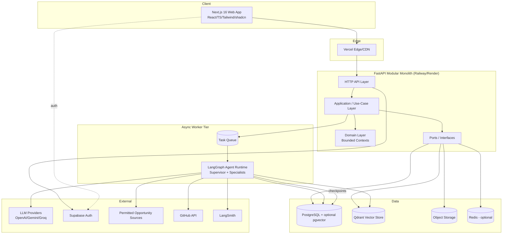

# CareerOS — System Architecture

> **Status:** LOCKED (see `docs/adr/0000-lock-architecture-documents.md`). Source of truth. Changes require an ADR.
> **Related authoritative docs:** `docs/domain-model.md` (domain detail), `docs/ai-architecture.md` (AI detail), `docs/technical-architecture.md` (implementation detail). Where those exist, they are authoritative for their topic; this document holds the high-level system view.

## 1. High-Level System Architecture

**Style: a modular monolith backend + a Next.js frontend + an async agent worker tier.** Not microservices.

**Key decisions & WHY:**
- **Modular monolith, not microservices.** A monolith with enforced internal module boundaries (bounded contexts as packages with explicit interfaces) gives ~90% of the "independently replaceable" benefit at ~10% of the operational cost. When a context needs independent scale (the agent worker tier), it's already isolated behind a queue and can be extracted.
- **Separate synchronous API from asynchronous agent workers.** LLM/agent runs are slow and failure-prone; running them in request/response would destroy UX and reliability. The API enqueues; workers run LangGraph graphs; the frontend subscribes to progress.
- **State lives outside compute.** Postgres (relational + checkpoints), Qdrant/pgvector (vectors), object storage (files), Redis (cache/queue). API and workers are stateless → horizontal scale is config, not rewrite.
- **Everything external is behind a Port.** LLM providers, vector DB, auth, opportunity sources, storage — each an interface with an adapter. This delivers replaceability and vendor portability.

## 2. Major Services (logical modules)

1. **Web BFF (Next.js)** — thin backend-for-frontend; auth session handling; calls FastAPI. Keeps secrets off the client.
2. **Core API Service (FastAPI)** — the modular monolith exposing REST/JSON; owns all bounded contexts.
3. **Agent Worker Service** — runs LangGraph graphs asynchronously; the only component talking to LLMs and external sources at scale.
4. **Ingestion/Scheduler Service** — periodic opportunity refresh, document parsing jobs, GitHub enrichment (starts as scheduled tasks in the worker tier).
5. **Notification Service** — email digests + in-app notifications (starts as a module, extractable later).

Only the agent worker tier is physically separate at MVP (different runtime characteristics: long-running, bursty, cost-sensitive). The rest are modules with clear interfaces first.

## 3. Bounded Contexts (strategic view)

Authoritative detail in `docs/domain-model.md`. Contexts and subdomain classification:

| Bounded Context | Subdomain type |
|---|---|
| Identity & Access | Generic |
| Career Profile | Supporting |
| Documents & Ingestion | Supporting |
| Skill Taxonomy | Supporting (shared reference) |
| Opportunity | Supporting / strategic |
| **Matching & Fit** | **Core** |
| **Preparation** | **Core** |
| Human Review & Actioning | Supporting (safety-critical) |
| Application Tracking | Supporting |
| **AI Orchestration & Ops** | **Core** |
| Notifications | Generic |
| Billing & Entitlements | Generic |
| Analytics | Supporting |
| Administration & Trust/Safety | Generic/Supporting |

**Communication:** asynchronous domain events for cross-context reactions; synchronous queries only within a context or on the read side. No context reaches into another's store.

## 4. Core Domain Model (summary)

Authoritative detail in `docs/domain-model.md`. Key aggregates: `User`, `Candidate`, `CareerProfile` (versioned), `Document`, `Skill` (canonical), `Opportunity`, `Match`, `PreparationArtifact`, `ReviewTask` (audit spine), `Application`, `AgentRun`, `Subscription`, `Notification`, plus `Memory` (long/short term). Profile is the derived source of truth; documents are evidence. Every externally-bound artifact passes an immutable `ReviewTask` approval.

## 5. AI Architecture (summary)

Authoritative detail in `docs/ai-architecture.md`. Pattern: a **deterministic Career Orchestration Graph** with an **embedded Supervisor** for open-ended goals, composed of specialized subgraphs. Principle: *"as deterministic as possible, as agentic as necessary."* Uses LangGraph typed state, structured outputs, tool calling with whitelists, dual memory, checkpointing, human-in-the-loop interrupts, observability, evaluation, retry/error recovery, and model tiering.

### 5a. Supervisor Agent Responsibilities
Orchestrator, not a doer: intent & goal decomposition; routing & delegation; state ownership; policy enforcement (no external-write tools, mandatory HITL, budget caps); error handling & recovery; checkpoint/resume coordination; termination & result assembly; observability hooks. It never calls LLMs for domain content and holds no external-write tools.

### 5b. Specialized Agents (list)
Profile Intelligence, Resume Intelligence, Opportunity Discovery, Opportunity Normalization, Match Intelligence, Ranking, Preparation (Tailoring), Cover Letter, Interview Coach *(P2)*, Career Coach *(P2)*, Learning, Memory, Notification, Evaluation, Analytics, plus a Guardrail/Safety check. Only a minority are true autonomous agents; most are deterministic components or single LLM steps (see AI doc).

## 6. Recommended Repository Structure (summary)

Authoritative detail in `docs/technical-architecture.md`. Monorepo with `apps/` (web, api, worker), `packages/` (contracts, sdk, ui, config), `shared/` (Python shared_kernel, platform, event_contracts), `agents/` (AI engine), `contexts/` (DDD bounded contexts, five-layer each), `evals/`, `infra/`, `docs/`.

## 7. Technology Decision Rationale

| Choice | Verdict | Why / Tradeoff |
|---|---|---|
| Next.js 16 + React + TS + Tailwind + shadcn/ui | Adopt | Best-in-class DX, SSR/streaming for AI UIs. Pin exact version. |
| FastAPI + Python | Adopt | Colocates with the AI ecosystem; typed, async, OpenAPI-native. |
| LangGraph (+ selective LangChain) | Adopt | Stateful graphs, checkpointing, HITL interrupts. Wrap LLM calls behind a provider Port. |
| Multi-provider LLMs (OpenAI-compat/Gemini/Groq) | Adopt behind a Port | Cost/latency arbitrage + resilience + portability. |
| PostgreSQL (+ pgvector) | Adopt | Relational integrity + JSONB + vectors + checkpoints in one reliable store. |
| Qdrant | Conditional/later | Start on pgvector; migrate when scale/features demand (behind VectorStore Port). |
| Supabase Auth (+ Storage) | Adopt | Generous free tier; don't build the auth surface. Mitigate lock-in via ports. |
| Redis | Optional MVP | Add when caching/throughput demand it. |
| LangSmith | Adopt | Purpose-built agent tracing + eval. |
| Vercel + Railway/Render | Adopt MVP | Cheapest path to production; separates edge web from always-on api/worker. |
| Object storage + task queue | Add (were unstated) | Files never in Postgres; async agent execution needs a queue. |

**Honest pushbacks:** Qdrant + Redis on day one contradict "don't over-engineer the MVP" — correct destinations, wrong starting points. "Multi-tenancy" as literally specified implies B2B isolation not needed for a B2C MVP; use per-user isolation now, schema-forward-compatible.

## 8. Security Considerations

Data classification first (resumes/salary/location = sensitive PII). Auth & session via Supabase, JWT verified server-side, secure httpOnly cookies via BFF. Authorization scoped per-user (RLS + repository filters — defense in depth). Encryption in transit + at rest; field-level for salary. Secrets in platform stores, per environment, rotation-ready. File uploads: strict validation, malware scanning, isolated parsing, signed expiring URLs. LLM-specific: prompt-injection defense (all ingested text untrusted), PII minimization to providers, output safety via guardrails. Least privilege for service creds and agent tools. Immutable audit of approvals + agent runs. DPDP controls: consent, purpose limitation, export/erasure, sub-processor register. Rate limiting + cost caps. Dependency/supply-chain hygiene.

## 9. Scalability Considerations

Stateless compute + externalized state; async everything expensive; read/write separation later (replicas before sharding); vector scale path pgvector → Qdrant; **cost as a scaling axis** (LLM $ before CPU) — model tiering, caching, batching, per-user budgets; ingestion designed idempotent/deduplicated/incremental/backpressure-aware; extractability of contexts behind interfaces. **Multi-tenancy:** per-user isolation now (RLS + user-scoped repos); reserve nullable `tenant_id`/`org_id`; real tenanting only when a B2B deal justifies it.

## 10. Known Risks

1. **[Critical — Legal] Third-party ToS & scraping.** Mitigation: no scraping/automation of protected platforms; permitted sources only; human hand-off not auto-submit; pursue official partnerships; legal review before any ingestion source ships.
2. **[Critical — Legal] DPDP non-compliance.** Mitigation: consent, purpose limitation, export/erasure, sub-processor transparency, India-preferred residency from MVP.
3. **[Critical — Security] Resume/PII breach or prompt-injection exfiltration.** Mitigation: treat ingested text as hostile; minimize PII to LLMs; no-train provider terms.
4. **[High — Ethical] AI fabrication in tailored resumes.** Mitigation: grounding constraints, guardrail agent, mandatory human review.
5. **[High — Financial] Runaway LLM costs.** Mitigation: model tiering, caching, per-user budgets, cost observability.
6. **[High — Product] "Auto-apply" expectation mismatch.** Mitigation: position HITL as a quality/safety feature; validate willingness-to-pay.
7. **[Medium — Quality] Mediocre match/tailoring → churn.** Mitigation: eval harness, feedback loops, tight IT/India focus.
8. **[Medium — Dependency] LLM/vendor volatility & lock-in.** Mitigation: provider Port, multi-provider.
9. **[Medium — Data] Opportunity coverage/quality.** Mitigation: few high-quality permitted sources; dedup + freshness.
10. **[Low–Medium — Ops] Over-engineering the MVP.** Mitigation: "start simple behind Ports."

## Assumptions & Open Questions
See `docs/vision.md` for the shared assumptions and open questions. The two decisions with the widest blast radius are opportunity-source legality and the permanence of the no-auto-submit / human-in-the-loop principle.
