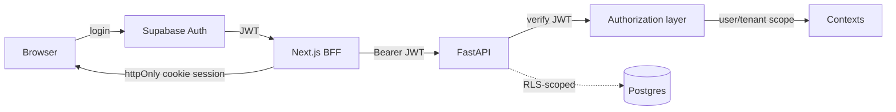
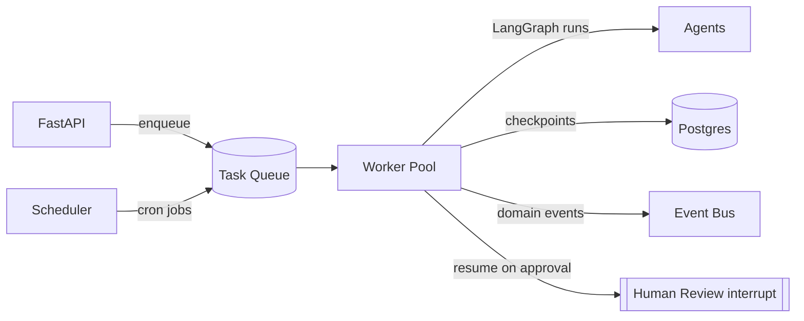
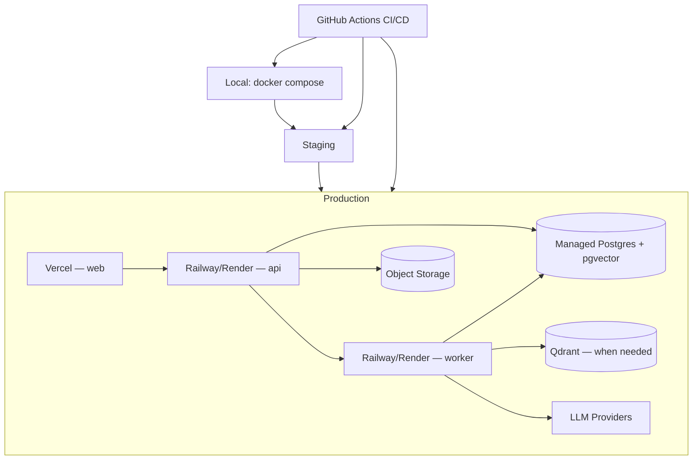
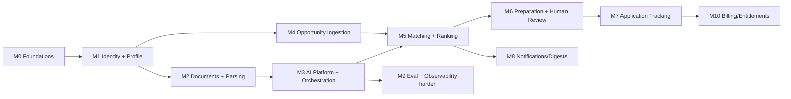

# CareerOS — Technical Architecture Specification

> **Status:** LOCKED (see `docs/adr/0000-lock-architecture-documents.md`). Permanent implementation blueprint. Changes require an ADR.

**Spine:** modular monolith (FastAPI) + Next.js frontend + async agent worker tier + event-driven cross-context communication, all behind ports/adapters.

## 1. Monorepo Structure

Single monorepo: **pnpm workspaces + Turborepo** (JS) and **uv/Poetry** (Python).

```
career-os/
├── apps/
│   ├── web/                    # Next.js 16 (App Router)
│   ├── api/                    # FastAPI modular monolith (sync HTTP)
│   ├── worker/                 # Async agent + background job runtime
│   └── admin/                  # (Phase 2) internal ops console
├── packages/                   # JS/TS shared
│   ├── contracts/              # OpenAPI-generated TS types + Zod (source: api)
│   ├── ui/                     # shared React components (shadcn)
│   ├── config/                 # TS/ESLint/Tailwind/tsconfig presets
│   └── sdk/                    # typed frontend API client
├── shared/                     # Python shared
│   ├── shared_kernel/          # VOs, Result/Either, errors, base domain event
│   ├── platform/               # config, logging, tracing, DI, auth middleware
│   └── event_contracts/        # versioned domain event definitions
├── agents/                     # AI engine
│   ├── orchestration/          # Career Orchestration Graph + Supervisor
│   ├── subgraphs/              # profile, discovery, matching, preparation, coaching
│   ├── tools/                  # permission-classified tool adapters
│   ├── memory/                 # memory service
│   ├── evaluation/             # judges, rubrics
│   └── prompts/                # versioned prompt registry
├── contexts/                   # DDD bounded contexts (domain/application/ports/infrastructure/api each)
│   ├── identity/ profile/ documents/ skill_taxonomy/ opportunity/ matching/
│   ├── preparation/ review/ application/ ai_orchestration/ notifications/ billing/
├── evals/                      # golden datasets + eval runners (CI gate)
├── infra/                      # docker/ deploy/ migrations/
├── docs/                       # locked specs + adr/
├── .github/workflows/
└── pnpm-workspace.yaml · turbo.json · pyproject.toml
```

| Decision | Rationale |
|---|---|
| Monorepo | Atomic cross-cutting changes, single CI, shared tooling, no version skew. |
| `contexts/` top-level | Domain is imported by api + worker; keeps framework out of domain. |
| `agents/` separate | Imported by worker (execute) and api (enqueue); fast-changing engine kept out of stable domain. |
| `packages/` vs `shared/` | Two language ecosystems, idiomatic each. |
| `contracts` generated from api OpenAPI | One source of truth; no drift. |
| `evals/` top-level | AI quality is a build gate, not an afterthought. |

> **Context coverage note (consistency with `docs/domain-model.md`):** the `contexts/` tree lists the actively-built contexts. The Domain Model also defines **Analytics** (implemented as CQRS read models, not a write aggregate) and **Administration & Trust/Safety** (arrives with `apps/admin` in Phase 2). Both remain bounded contexts per the Domain Model and are added under `contexts/` when built.

## 2. Backend Architecture

Modular monolith, Clean/Hexagonal per context, dependency-inverted (`api → application → domain`; `infrastructure` implements `ports`).

| Concern | Design |
|---|---|
| Layering | domain depends on nothing; infrastructure implements ports. |
| DI | Constructor injection / FastAPI `Depends` at edge; wiring in `shared/platform`. |
| Repositories | One per aggregate root; interface in ports, impl in infrastructure. |
| Services | Domain services (pure) + application services (orchestrate use cases). |
| Ports | LLMProvider, VectorStore, AuthProvider, Storage, EventPublisher, OpportunitySource, repositories. |
| Adapters | Only place vendor SDKs appear. |
| Middleware | Auth (JWT verify), request-id/trace, rate limiting, structured logging, error translation, user/tenant scoping. |
| Background workers | Separate `worker` consuming a queue; API only enqueues. |
| Configuration | Typed settings (pydantic-settings) per environment; no literals. |
| Secrets | Platform secret stores injected as env; never in repo. |
| Validation | Pydantic at boundary + domain invariants inside aggregates. |
| Error handling | Domain errors → application result/exceptions → api problem-details. No leaking stack traces. |
| Logging | Structured JSON, correlation/trace id, PII-redacted. |

Cross-context communication: sync within a context; across via domain events (in-process dispatcher for MVP, extractable to a broker).

## 3. Frontend Architecture

Next.js 16 App Router, Server-Components-first, feature-sliced.

```
apps/web/
├── app/                    # route groups per feature; api/ = BFF handlers
├── features/               # vertical slices mirroring backend contexts
│   └── <feature>/{components,hooks,actions,schemas,api}
├── components/             # shared presentational (from packages/ui)
├── lib/                    # sdk client, auth helpers, utils
└── styles/
```

| Concern | Design |
|---|---|
| App Router | Route groups per feature; streaming/Suspense for AI latency. |
| Feature-based | Vertical slices mirroring contexts. |
| Components | Presentational (packages/ui, shadcn/Radix) vs feature containers. |
| State | Server state via TanStack Query; URL state for filters; minimal Zustand/Context. No global Redux. |
| Server Components | Default (data, secrets, heavy rendering). |
| Client Components | Opt-in (forms, editors, review cockpit). |
| Caching | Next.js data cache + revalidation tags; TanStack Query; explicit invalidation on mutation. |
| Forms | React Hook Form + Zod (schemas from contracts); Server Actions. |
| Accessibility | Radix a11y, semantic HTML, keyboard nav, WCAG-conscious, i18n-ready. |

BFF pattern: Next.js server layer holds the Supabase session and calls FastAPI — secrets never reach the browser.

## 4. Shared Packages

| Package | Contents | Consumers |
|---|---|---|
| `packages/contracts` | OpenAPI-generated TS types + Zod (source: api) | web, sdk |
| `packages/sdk` | Typed API client (auth, retries, error mapping) | web (+ future mobile) |
| `packages/ui` | shadcn components, design tokens | web, admin, future mobile |
| `packages/config` | ESLint/TS/Tailwind/Prettier presets | all JS apps |
| `shared/shared_kernel` | VOs, Result/Either, base domain event, error taxonomy | all contexts |
| `shared/event_contracts` (+ contracts mirror) | Versioned domain event schemas | producers/consumers/analytics |
| `shared/platform` | config, logging, tracing, DI, auth middleware | api, worker |
| `agents/` AI contracts | Agent I/O schemas, state schema, tool contracts | agents, ai_orchestration |

Every event and agent I/O schema is versioned; breaking changes require a new version + migration note.

## 5. Authentication & Authorization



| Concern | Design |
|---|---|
| Provider | Supabase Auth (email + OAuth Google/GitHub). |
| Session | Short-lived JWT + refresh; server-side in BFF via secure httpOnly cookies. |
| Identity mapping | Our `User` aggregate is source of truth; Supabase is an `authRef`. |
| Authorization | Policy-based (RBAC now, ABAC-ready); enforced in application layer AND DB (RLS). |
| Roles (MVP) | `candidate`, `admin`. Reserved: `recruiter`, `org_admin`. |
| Permissions | Capability checks per use case. |
| Future enterprise | Nullable `tenant_id`/`org_id`; RLS ready to scope; SSO/SAML via provider port later. |

## 6. File Storage

| Concern | Design |
|---|---|
| Store | S3-compatible (Supabase Storage MVP) behind `Storage` port. |
| Upload flow | Client → signed URL → direct-to-storage; backend records `Document` metadata. |
| Types | Resumes, cover letters, certs (PDF/DOCX), portfolio files, images, generated artifacts. |
| Versioning | Immutable objects + append-only `ResumeVersion`; "current" is a pointer. |
| Virus scanning | Async scan (ClamAV/hosted) before parse; quarantine on hit. |
| Access | Signed short-expiry URLs; per-user scoping; private buckets. |
| Generated artifacts | Stored with lineage (sourceProfileVersion, opportunityId, approval ref). |
| Retention | Lifecycle policies; erasure cascade on account deletion (DPDP). |

## 7. Background Processing



| Concern | Design |
|---|---|
| Queue | Postgres-backed or Arq/RQ (Redis) behind a `TaskQueue` port; add Redis when throughput demands. |
| Scheduled jobs | Cron for ingestion, freshness sweeps, digests, reminders. |
| Retry | Exp backoff + jitter, bounded attempts, idempotency keys, dead-letter queue. |
| Long-running AI | Durable checkpointed LangGraph runs; resumable; `WaitingForHuman` parks the run. |
| Job ingestion | Incremental (cursors), idempotent, deduped, backpressure-aware. |
| Notification scheduling | Batching windows + frequency caps pre-dispatch. |
| Isolation | Separate worker pools/queues by workload class later. |

## 8. Configuration Management

| Concern | Design |
|---|---|
| Env vars | Typed settings; `.env.example` documents all; fail-fast on missing. |
| Secrets | Platform secret stores per env; rotation-ready; never committed. |
| Feature flags | Config-driven (env/DB) → flag service later; gate P2 agents, HITL rules, model tiers. |
| Provider abstraction | `LLMProvider` port with adapters; selection via config. |
| Model routing | Declarative routing table (task → model tier) + cost/latency policy + fallback chain; hot-swappable. |

## 9. Security Architecture

| Domain | Controls |
|---|---|
| OWASP Top 10 | Input validation, output encoding, authz per request, dependency scanning, secure headers/CSP. |
| Rate limiting | Per-user + per-IP; stricter on auth + AI; cost caps on AI. |
| RLS | Postgres row-level security per user/tenant. |
| Encryption | TLS; at rest (DB + storage); field-level for salary. |
| Audit logs | Immutable: approvals, auth events, admin actions, tool invocations. |
| Prompt injection | All ingested text untrusted; tool whitelists; ingested content can't escalate permissions or write long-term memory; output guardrails. |
| File validation | Type/size/content sniffing + malware scan + isolated parsing. |
| PII protection | Classification, minimization to LLMs, redaction in logs/traces, no-train providers, DPDP export/erasure, India residency preference, sub-processor register. |

## 10. Observability

| Pillar | Design |
|---|---|
| Logging | Structured JSON, correlation id per line, PII-redacted, centralized. |
| Metrics | RED for HTTP; queue depth/lag; AI success/HITL/guardrail/eval-score; per-user cost. |
| Tracing | OpenTelemetry across web→api→worker; single `traceId`. |
| AI tracing | LangSmith per Agent Run correlated to `AgentRun` + events + cost. |
| Health checks | Liveness/readiness + dependency checks (api + worker). |
| Monitoring/alerting | Dashboards + alerts on error rate, p99, queue lag, cost anomalies, eval regressions. |
| Error reporting | Sentry (or equivalent) with release + trace context. |

## 11. Deployment Architecture



| Concern | Design |
|---|---|
| Environments | development (local docker compose), staging (prod-like, seeded), production. |
| CI/CD | GitHub Actions: lint → typecheck → tests → eval gate → build → deploy (preview per PR, staging on merge, prod on release). |
| Containers | Dockerized api + worker; web on Vercel-native build. |
| Infrastructure | Managed Postgres (pgvector), object storage; Redis/Qdrant added when justified. |
| Domains/CDN | Vercel CDN/edge for web; API stable domain; TLS everywhere. |
| Backups/DR | Automated Postgres backups + PITR; storage versioning; tested restore; documented RPO/RTO. |
| Rollbacks | Immutable deploys, one-click rollback, expand/contract migrations. |

## 12. Technology Decisions

| Choice | Verdict | Alternatives & tradeoff |
|---|---|---|
| FastAPI + Python | Adopt | vs Node/Nest: colocates with AI stack. |
| Modular monolith | Adopt | vs microservices: 90% benefit, 10% cost. |
| Next.js 16 App Router | Adopt | SSR+streaming for AI latency. Pin version. |
| Postgres (+pgvector) | Adopt | One store: relational + vectors + checkpoints. |
| Qdrant | Later | Adopt when pgvector limits hit; behind port. |
| Redis | Optional | Add when throughput/caching demands. |
| Supabase Auth + Storage | Adopt | Free tier; mitigate lock-in via ports + own User aggregate. |
| LangGraph | Adopt | Typed state, checkpointing, HITL. Wrap LLM behind provider port. |
| Multi-provider LLM | Adopt | Routing/fallback/arbitrage. |
| TanStack Query + Zustand | Adopt | vs Redux: lighter; most state is server cache. |
| shadcn/ui + Tailwind | Adopt | Control, accessible primitives, mobile reuse. |
| Turborepo + pnpm / uv | Adopt | Simple, fast caching, JS+Py split. |
| Vercel + Railway/Render | Adopt MVP | Cheapest path; containerized so migratable. |
| LangSmith + OTel + Sentry | Adopt | AI tracing + standard observability. |
| GitHub Actions | Adopt | Native, sufficient, portable. |

## 13. Implementation Order (Roadmap)



| Milestone | Build | Depends on |
|---|---|---|
| M0 Foundations | Monorepo, CI/CD, DI/platform, config/secrets, logging/tracing, contracts pipeline, docker compose, health checks. | — |
| M1 Identity + Profile | Supabase Auth, User/Candidate/CareerProfile (manual), preferences, consent, RLS. | M0 |
| M2 Documents + Parsing | Upload, storage, virus scan, Document/versions, parsing (deterministic + Resume/Profile LLM steps). | M1 |
| M3 AI Platform + Orchestration | Provider ports + routing, LangGraph runtime, state schema, checkpointer, memory (pgvector), guardrails, AgentRun, LangSmith. | M0 (parallel with M1/M2) |
| M4 Opportunity Ingestion | Permitted-source adapters (ACL), normalization, dedup, Company, freshness, scheduler. | M1 |
| M5 Matching + Ranking | Match Intelligence (grounded), hard filters, explanations, ranking, recommendations. | M2, M3, M4 |
| M6 Preparation + Human Review | Tailoring (self-critique), cover letter, guardrails, Review cockpit + approval. | M5 |
| M7 Application Tracking | Applications, interviews, offers, pipeline UI. | M6 |
| M8 Notifications/Digests | Digest composition, delivery, frequency caps, reminders. | M5 |
| M9 Eval + Observability harden | Golden datasets, judges, CI eval gate, dashboards, cost/latency alerts. | M3 |
| M10 Billing/Entitlements | Plans, usage/cost caps, entitlement gates. | M7 |

**Critical path:** M0 → M1 → M2/M3 → M4 → M5 → M6. M3 and M4 can run in parallel with the profile track. **M4 must not start ingestion without legal sign-off** on sources.

## Assumptions & Open Questions

**Assumptions:** small team (operational simplicity); pgvector + Postgres-queue for MVP behind ports; Supabase Auth + Storage; in-process event bus (extractable); contracts versioned from day one; multi-tenancy reserved; legal sign-off precedes M4.

**Open Questions:** (1) Queue tech commitment. (2) Event bus (in-process vs broker). (3) Opportunity sources legally cleared? (4) Match recomputation strategy. (5) Feature-flag tooling. (6) Secrets/rotation ownership. (7) Data residency hard requirement? (8) CI eval-gate strictness.
